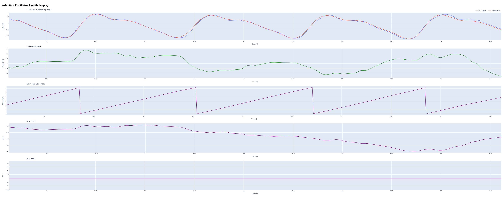

# Adaptive Oscillator
[](https://coveralls.io/github/TUM-Aries-Lab/template-python?branch=main)


AOs can be described as a mathematical tool able to synchronize with a rhythmic and periodic signal by continuously estimating its fundamental features (i.e. frequency, amplitude, phase, and offset). For their properties, AOs found applications in gait pattern estimation strategies, where they are used to mimic the dynamics of the neuromechanical oscillators in charge of the rhythmical human locomotion. In addition, as gait periodicity can be captured by sensors recording joint kinematics, their application does not require a complex sensory network.

## Install
To install the library run: `pip install adaptive-oscillator`

## Development
0. Install [Poetry](https://python-poetry.org/docs/#installing-with-the-official-installer)
1. `make init` to create the virtual environment and install dependencies
2. `make format` to format the code and check for errors
3. `make test` to run the test suite
4. `make clean` to delete the temporary files and directories
5. `poetry publish --build` to build and publish to https://pypi.org/project/adaptive-oscillator


## Usage
```
"""Basic usage for our module."""

def main() -> None:
    """Run a simple demonstration."""
    # Initialize system
    controller = AOController(show_plots=True)

    while True:
        try:
            self.step(t=t, th=angle, dth=angle_derivative)
        except KeyboardInterrupt as KI:
            print("Exiting...")

if __name__ == "__main__":
    main()
```

## Results
The plot below shows the results being plotted in real time.


